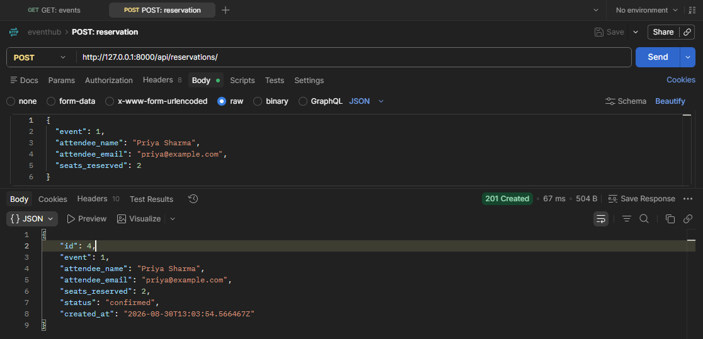
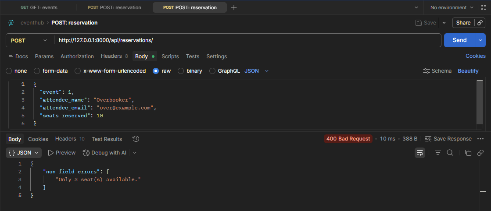
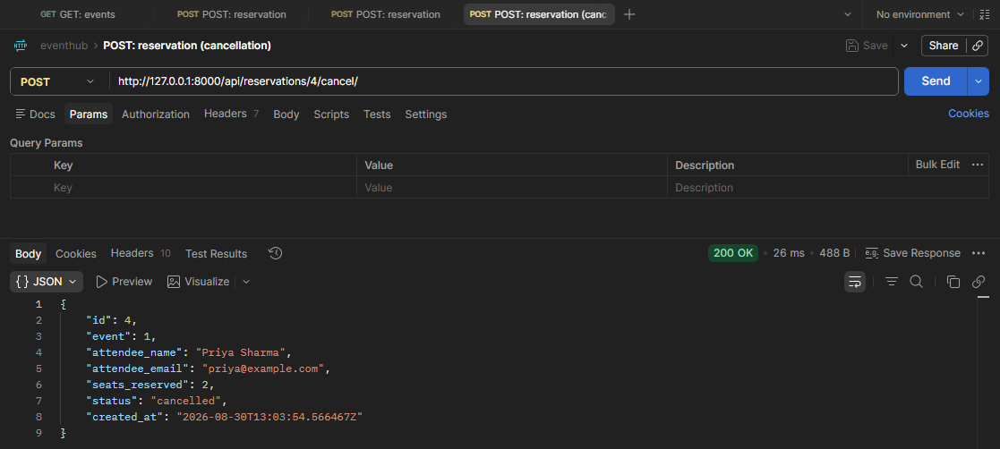

# EventHub

A backend API for a simplified event ticketing platform, built with Django and Django REST Framework. Users can browse events, reserve seats, and cancel reservations.

## How to Run the Project

```bash
# 1. Clone the repository
git clone <your-repo-url>
cd eventhub

# 2. Create and activate a virtual environment
python -m venv venv
venv\Scripts\activate        # Windows
source venv/bin/activate     # macOS / Linux

# 3. Install dependencies
pip install -r requirements.txt

# 4. Apply migrations
python manage.py makemigrations
python manage.py migrate

# 5. Run the server
python manage.py runserver
```

The API will be available at `http://127.0.0.1:8000/api/`.

Every request is logged to the terminal by `RequestLoggingMiddleware` in the form:
`METHOD /path - STATUS_CODE - duration_in_seconds`

## Pagination

All list endpoints (`GET /api/events/`, `GET /api/reservations/`) are paginated using DRF's `PageNumberPagination`, 10 items per page. Responses are wrapped as:

```json
{
  "count": 23,
  "next": "http://127.0.0.1:8000/api/events/?page=2",
  "previous": null,
  "results": [ ... ]
}
```

Use `?page=2` (combinable with existing filters, e.g. `?status=upcoming&page=2`) to navigate pages.

## Endpoints

### Events

| Method | Path                        | Description                     |
|--------|-----------------------------|----------------------------------|
| GET    | `/api/events/`              | List all events                 |
| POST   | `/api/events/`               | Create a new event               |
| GET    | `/api/events/{id}/`          | Retrieve a single event          |
| PUT    | `/api/events/{id}/`          | Update an event                  |
| DELETE | `/api/events/{id}/`          | Delete an event                  |
| GET    | `/api/events/?status=upcoming` | Filter events by status        |
| GET    | `/api/events/?venue=mumbai`  | Filter events by venue (partial, case-insensitive) |

Each event response includes a computed `reservations_count` — the number of `confirmed` reservations for that event.

### Reservations

| Method | Path                                  | Description                       |
|--------|----------------------------------------|------------------------------------|
| GET    | `/api/reservations/`                   | List all reservations              |
| POST   | `/api/reservations/`                   | Create a reservation (deducts seats from the event) |
| GET    | `/api/reservations/{id}/`              | Retrieve a single reservation      |
| GET    | `/api/reservations/?event_id=1`        | Filter reservations by event       |
| POST   | `/api/reservations/{id}/cancel/`       | Cancel a reservation (restores seats to the event) |

Creating a reservation is rejected with `400` if:
- the event's status is not `upcoming` or `ongoing`, or
- `seats_reserved` exceeds the event's `available_seats`.

Cancelling a reservation that is already `cancelled` returns `400`.

## Screenshots

**Successful reservation** — `POST /api/reservations/` → `201 Created`



**Overbooking failure** — `POST /api/reservations/` with excess seats → `400 Bad Request`



**Successful cancellation** — `POST /api/reservations/{id}/cancel/` → `200 OK`



## Design Decision

**Seat deduction happens inside `ReservationSerializer.create()`, in the same method call that creates the `Reservation` row**, rather than as a separate step in the view or via a Django signal. Keeping both writes (decrementing `Event.available_seats` and inserting the `Reservation`) in one place makes the seat-accounting logic easy to find and reason about — there's exactly one code path that can change seat counts on booking, and the mirror-image logic (restoring seats) lives the same way in `ReservationViewSet.cancel()`.

The trade-off: this is not safe under concurrent requests as written. Two simultaneous POSTs for the last available seat could both pass the `validate()` check before either has saved, resulting in overbooking (a classic race condition/TOCTOU bug). A production version of this would wrap the read-check-write sequence in `transaction.atomic()` combined with `select_for_update()` on the `Event` row to serialize concurrent reservation attempts against the same event. That was intentionally left out here to match the scope of this assignment, which treats it as a topic for a future session.
